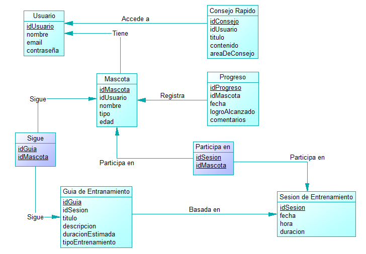
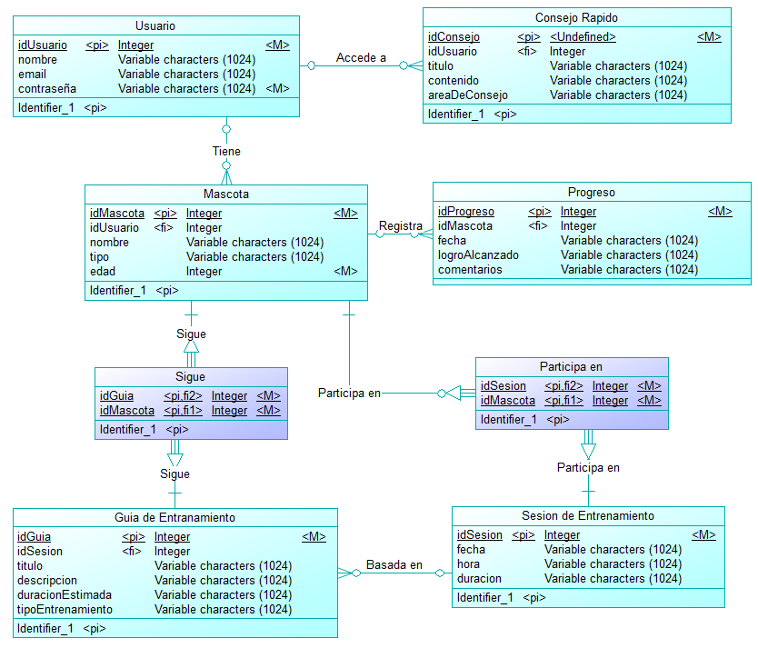
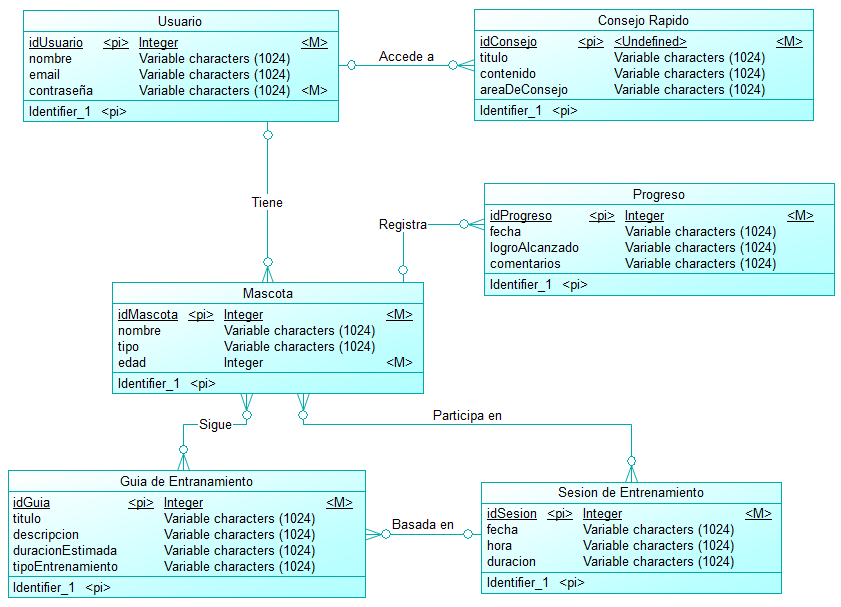

<h1>ESCUELA POLITÉCNICA NACIONAL</h1>
<h2> FACULTAD DE INGENIERÍA DE SISTEMAS </h2>
<h2> INGENIERÍA EN SOFTWARE </h2>

---

**PERÍODO ACADÉMICO:** 2024-A 
**ASIGNATURA:** Aplicaciones Móviles 
**GRUPO:** GR1SW 
**Docente:** VICENTE ADRIAN EGUEZ SARZOSA 

---
**TIPO DE INSTRUMENTO:** Proyecto 
**TÍTULO:** Historias De Usuario 
**FECHA DE ENTREGA:** 30 de junio de 2024 
**Estudiantes:** 

- Chalacama Erick
- Suntasig Ariel

---

## Versión: Primera

# Estructura de la base de datos del sistema de Entrenamiento de Mascotas "EduPet"

---

## 🖼️ Modelo Físico

---
---

## 🖼️ Modelo Lógico

---
---

## 🖼️ Modelo Conceptual

---
---

