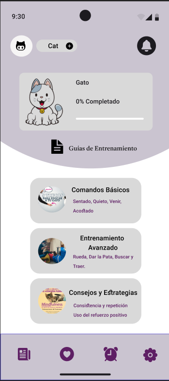
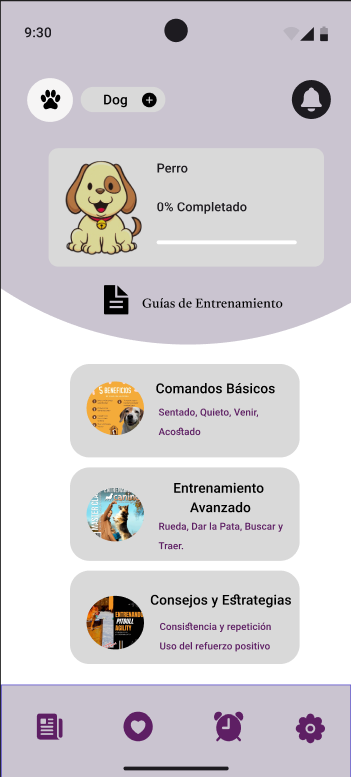
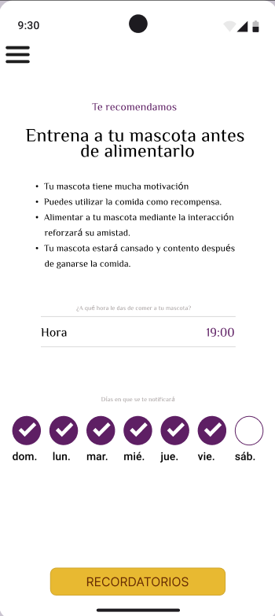
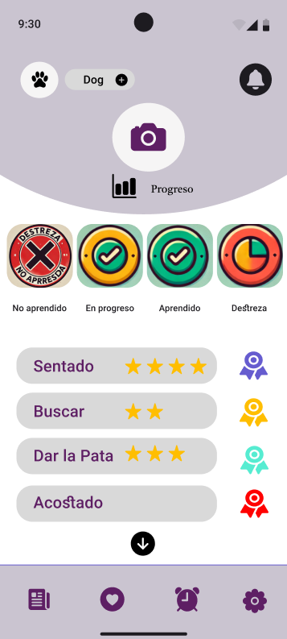
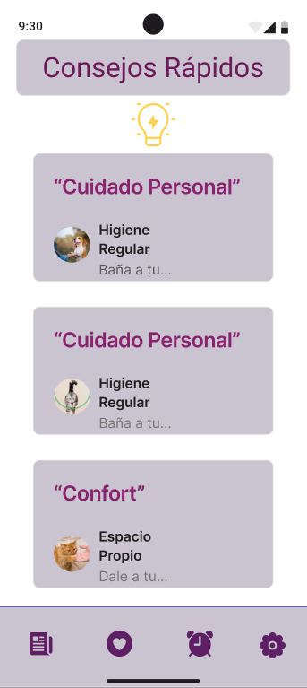
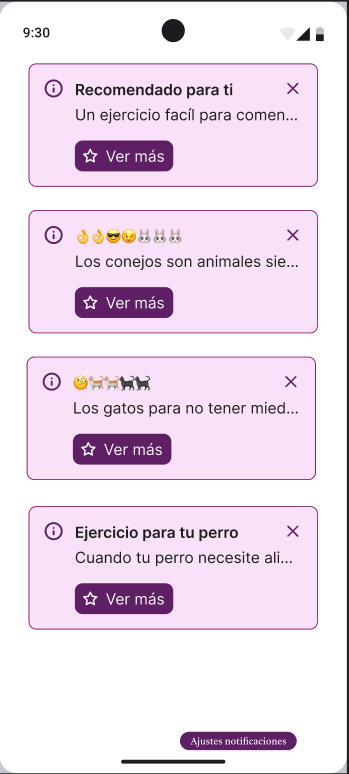
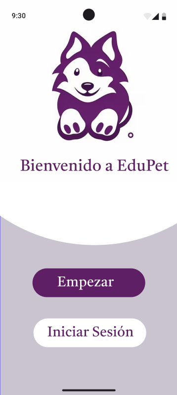
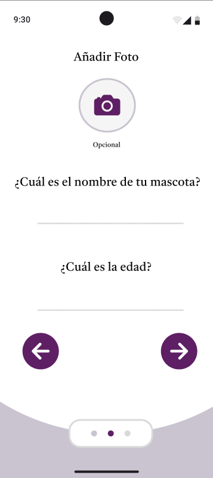
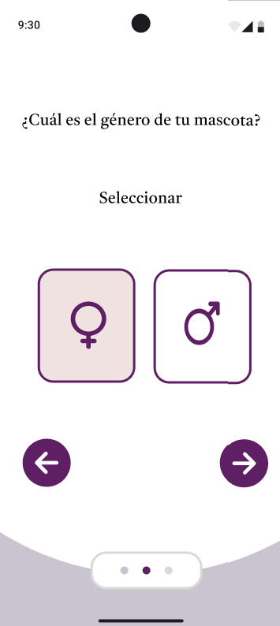

<h1>ESCUELA POLITÉCNICA NACIONAL</h1>
<h2> FACULTAD DE INGENIERÍA DE SISTEMAS </h2>
<h2> INGENIERÍA EN SOFTWARE </h2>

---

**PERÍODO ACADÉMICO:** 2024-A
**ASIGNATURA:** Aplicaciones Móviles
**GRUPO:** GR1SW
**Docente:** VICENTE ADRIAN EGUEZ SARZOSA

---
**TIPO DE INSTRUMENTO:** Proyecto
**TÍTULO:** Historias De Usuario
**FECHA DE ENTREGA:** 30 de junio de 2024
**Estudiantes:**

- Chalacama Erick
- Suntasig Ariel

---

## Versión: Primera

# Historias De Usuario del sistema de Entrenamiento de Mascotas "EduPet"

---

## 📝 Historia de Usuario: Visualización de Guías de Entrenamiento

| **Campo**                    | **Descripción**                                                                                                                      |
|:----------------------------:|:------------------------------------------------------------------------------------------------------------------------------------|
| **🆔 ID:**                   | `001`                                                                                                                                  |
| **📖 Título:**               | `Visualización de Guías de Entrenamiento`                                                                               |
| **⭐ Prioridad:**            | `Alta`                                                                                                                               |
| **💪 Estimación:**           | `5`                                                                                                                                  |
| **👤 Autor:**                | `Cliente`                                                                                                                     |
| **📅 Fecha:**                | `27/06/2024`                                                                                                                         |
| **📝 Historia de usuario:**  | **Yo como** usuario de la aplicación, **quiero** acceder a guías detalladas de entrenamiento, **para** seguir un plan estructurado y efectivo con mi mascota. |
| **✅ Criterio de aceptación:**| **Dado** que quiero entrenar a mi mascota, **cuando** accedo a la sección de guías, **entonces** quiero ver una lista de guías categorizadas y detalladas con instrucciones paso a paso. |

---

### 🖼️ Prototipo

---
---

## 📝 Historia de Usuario: Recordatorios de Entrenamiento

| **Campo**                    | **Descripción**                                                                                                                      |
|:----------------------------:|:------------------------------------------------------------------------------------------------------------------------------------|
| **🆔 ID:**                   | `002`                                                                                                                                  |
| **📖 Título:**               | `Recordatorios de Entrenamiento antes de alimentar a tu mascota`                                                                               |
| **⭐ Prioridad:**            | `Media`                                                                                                                               |
| **💪 Estimación:**           | `3`                                                                                                                                  |
| **👤 Autor:**                | `Cliente`                                                                                                                     |
| **📅 Fecha:**                | `27/06/2024`                                                                                                                         |
| **📝 Historia de usuario:**  | **Yo como** usuario de la aplicación, **quiero** recibir recordatorios de sesiones de entrenamiento, **para** asegurarme de mantener una rutina constante. |
| **✅ Criterio de aceptación:**| **Dado** que quiero mantener una rutina de entrenamiento, **cuando** programo recordatorios, **entonces** quiero recibir notificaciones en mi dispositivo en los horarios establecidos antes de alimentarlo. |

---

### 🖼️ Prototipo

---
---

## 📝 Historia de Usuario: Seguimiento de Progreso

| **Campo**                    | **Descripción**                                                                                                                      |
|:----------------------------:|:------------------------------------------------------------------------------------------------------------------------------------|
| **🆔 ID:**                   | `003`                                                                                                                                  |
| **📖 Título:**               | `Seguimiento de Progreso`                                                                               |
| **⭐ Prioridad:**            | `Alta`                                                                                                                               |
| **💪 Estimación:**           | `8`                                                                                                                                  |
| **👤 Autor:**                | `Cliente`                                                                                                                     |
| **📅 Fecha:**                | `27/06/2024`                                                                                                                         |
| **📝 Historia de usuario:**  | **Yo como** usuario de la aplicación, **quiero** llevar un registro del progreso de entrenamiento de mi mascota, **para** ver su evolución y ajustar el plan según sea necesario. |
| **✅ Criterio de aceptación:**| **Dado** que estoy entrenando a mi mascota, **cuando** accedo a la sección de progreso, **entonces** quiero registrar el progreso realizado y ver un resumen de las actividades completadas de mi mascota. |

---

### 🖼️ Prototipo

---
---

## 📝 Historia de Usuario: Acceso a Consejos Rápidos

| **Campo**                    | **Descripción**                                                                                                                      |
|:----------------------------:|:------------------------------------------------------------------------------------------------------------------------------------|
| **🆔 ID:**                   | `004`                                                                                                                                  |
| **📖 Título:**               | `Acceso a Consejos Rápidos`                                                                               |
| **⭐ Prioridad:**            | `Media`                                                                                                                               |
| **💪 Estimación:**           | `2`                                                                                                                                  |
| **👤 Autor:**                | `Cliente`                                                                                                                     |
| **📅 Fecha:**                | `27/06/2024`                                                                                                                         |
| **📝 Historia de usuario:**  | **Yo como** usuario de la aplicación, **quiero**  acceder a una sección de consejos rápidos, **para** obtener recomendaciones útiles sobre el entrenamiento de mi mascota de manera inmediata.|
| **✅ Criterio de aceptación:**| **Dado**  que quiero obtener consejos rápidos, **cuando** accedo a la sección correspondiente,  **entonces** quiero ver una lista de consejos breves y prácticos sobre diferentes aspectos de entrenamiento. |

---

### 🖼️ Prototipo

---
---

## 📝 Historia de Usuario: Consejos Diarios

| **Campo**                    | **Descripción**                                                                                                                      |
|:----------------------------:|:------------------------------------------------------------------------------------------------------------------------------------|
| **🆔 ID:**                   | `005`                                                                                                                                  |
| **📖 Título:**               | `Recepción de Consejos Diarios para el Entrenamiento`                                                                               |
| **⭐ Prioridad:**            | `Baja`                                                                                                                               |
| **💪 Estimación:**           | `2`                                                                                                                                  |
| **👤 Autor:**                | `Cliente`                                                                                                                     |
| **📅 Fecha:**                | `27/06/2024`                                                                                                                         |
| **📝 Historia de usuario:**  | **Yo como** usuario de la aplicación, **quiero** recibir consejos diarios sobre entrenamiento de mascotas, **para** obtener recomendaciones útiles sobre el entrenamiento de mi mascota de manera inmediata.|
| **✅ Criterio de aceptación:**| **Dado**  que deseo aprender más sobre el entrenamiento de mascotas, **cuando** enciendo mi celular en las mañanas,  **entonces** quiero ver un nuevo consejo o truco para entrenar a mi mascota. |

---

### 🖼️ Prototipo

---
---

## 📝 Historia de Usuario: Registro de Mascotas

| **Campo**                    | **Descripción**                                                                                                                      |
|:----------------------------:|:------------------------------------------------------------------------------------------------------------------------------------|
| **🆔 ID:**                   | `006`                                                                                                                                  |
| **📖 Título:**               | `Registro de Mascotas en la Aplicación`                                                                               |
| **⭐ Prioridad:**            | `Alta`                                                                                                                               |
| **💪 Estimación:**           | `3`                                                                                                                                  |
| **👤 Autor:**                | `Cliente`                                                                                                                     |
| **📅 Fecha:**                | `27/06/2024`                                                                                                                         |
| **📝 Historia de usuario:**  | **Yo como** usuario de la aplicación, **quiero** registrar a mi mascota en la aplicación, **para** para llevar un seguimiento adecuado de su entrenamiento.|
| **✅ Criterio de aceptación:**| **Dado**  que tengo una nueva mascota, **cuando** ingreso a la aplicación,  **entonces** tener la opción de agregarla a mi perfil con información como nombre, edad, genero y foto. |

---

### 🖼️ Prototipo

---
---
